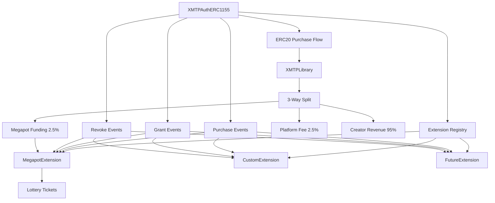

# 🔌 XMTPAuth V2 Extension System

The XMTPAuth V2 architecture includes a powerful extension system that allows you to add custom functionality to your authentication contracts. Extensions are separate contracts that receive notifications about token purchases, grants, and revocations, enabling you to build complex integrations and gamified experiences.

## 🏗️ Architecture Overview



## 📋 Extension Interface

All extensions must implement the `IExtension` interface:

```solidity
interface IExtension {
    function onTokenPurchased(
        address buyer,
        uint256 tokenId,
        uint256 amount,
        uint256 totalPrice,
        address paymentToken
    ) external;

    function onTokenGranted(
        address recipient,
        uint256 tokenId,
        uint256 amount,
        address grantedBy
    ) external;

    function onTokenRevoked(
        address user,
        uint256 tokenId,
        uint256 amount,
        string memory reason
    ) external;

    function getExtensionInfo()
        external
        view
        returns (
            string memory name,
            string memory version,
            bool isActive
        );
}
```

## 🎰 Built-in Extensions

### MegapotExtension

Automatically purchases lottery tickets when users buy access tokens, creating a gamified experience. The extension now supports both **legacy pre-funding** and the new **direct funding system**.

#### **🎯 Direct Funding System (NEW)**

The revolutionary direct funding system uses actual USDC from user purchases to buy lottery tickets, eliminating the need for manual funding.

**Key Features:**
- **Automatic 3-way payment split**: Platform (2.5%) + Creator (95%) + Megapot (2.5%)
- **Configurable funding percentage**: 0.1% - 10% of purchase amount
- **Smart limits**: Minimum 1 ticket ($1 USDC), configurable maximums
- **Backward compatible**: Seamlessly falls back to pre-funding when needed
- **No manual funding required**: Uses actual purchase amounts

**Configuration:**
```solidity
struct MegapotConfig {
    bool useDirectFunding;     // Enable/disable direct funding
    uint256 fundingPercentage; // Percentage in basis points (250 = 2.5%)
    uint256 minTicketAmount;   // Minimum USDC for 1 ticket (1e6 = $1)
    uint256 maxTicketAmount;   // Maximum USDC per purchase (10e6 = $10)
    // ... other legacy fields
}
```

**Usage Examples:**

**Basic Setup with Direct Funding:**
```solidity
// Deploy with Megapot extension (direct funding enabled by default)
(address baseContract, address megapotExt) = factory.deployXMTPAuthWithMegapot(
    config,
    "0xbEDd4F2beBE9E3E636161E644759f3cbe3d51B95", // Megapot on Base
    referrerAddress
);

// Configure direct funding (optional - has sensible defaults)
MegapotExtension(megapotExt).updateDirectFundingConfig(
    true,           // useDirectFunding
    250,            // 2.5% of purchase → tickets
    1e6,            // $1 USDC minimum for 1 ticket
    10e6            // $10 USDC maximum per purchase
);

// No manual funding needed! Tickets are purchased automatically from user payments
```

**Advanced Configuration:**
```solidity
// Higher funding percentage for premium experiences
MegapotExtension(megapotExt).updateDirectFundingConfig(
    true,   // useDirectFunding
    500,    // 5% of purchase → tickets
    2e6,    // $2 USDC minimum for 1 ticket
    50e6    // $50 USDC maximum per purchase
);

// Conservative funding for smaller purchases
MegapotExtension(megapotExt).updateDirectFundingConfig(
    true,   // useDirectFunding
    100,    // 1% of purchase → tickets
    1e6,    // $1 USDC minimum
    5e6     // $5 USDC maximum
);
```

**Payment Flow Example:**
```
User Purchase: $100 USDC
├── Platform Fee: $2.50 (2.5%) → Platform
├── Creator Revenue: $95.00 (95%) → Creator
└── Megapot Funding: $2.50 (2.5%) → 2 lottery tickets

User Purchase: $40 USDC  
├── Platform Fee: $1.00 (2.5%) → Platform
├── Creator Revenue: $38.00 (95%) → Creator
└── Megapot Funding: $1.00 (2.5%) → 1 lottery ticket

User Purchase: $20 USDC
├── Platform Fee: $0.50 (2.5%) → Platform
├── Creator Revenue: $19.50 (97.5%) → Creator
└── Megapot Funding: $0.50 (< $1 min) → No tickets, fallback to pre-funding if available
```

#### **🔄 Legacy Pre-Funding System**

The original pre-funding system continues to work for backward compatibility:

```solidity
// Disable direct funding to use legacy mode
MegapotExtension(megapotExt).updateDirectFundingConfig(
    false,  // useDirectFunding = false
    0,      // fundingPercentage (unused)
    0,      // minTicketAmount (unused)
    0       // maxTicketAmount (unused)
);

// Configure legacy settings
MegapotExtension(megapotExt).updateConfiguration(
    true,           // active
    2,              // 2 tickets per purchase
    0.001 ether,    // minimum purchase for tickets
    true,           // value-proportional
    10              // max 10 tickets
);

// Manual funding required
usdc.approve(megapotExt, 1000e6); // 1000 USDC
MegapotExtension(megapotExt).depositMegapotTokens(1000e6);
```

#### **🔧 Hybrid Mode**

You can also use both systems together:

```solidity
// Enable direct funding with fallback to pre-funding
MegapotExtension(megapotExt).updateDirectFundingConfig(
    true,   // useDirectFunding
    250,    // 2.5% funding
    5e6,    // $5 minimum (high threshold)
    20e6    // $20 maximum
);

// Also deposit some USDC for small purchases that don't meet direct funding minimum
usdc.approve(megapotExt, 100e6); // 100 USDC for fallback
MegapotExtension(megapotExt).depositMegapotTokens(100e6);

// Now:
// - Large purchases ($20+) use direct funding
// - Small purchases use pre-funding fallback
// - No tickets lost due to insufficient funding
```

#### **🔧 Technical Implementation**

The direct funding system introduces several new components:

**XMTPLibrary Enhancement:**
```solidity
// New 3-way split function
function handleERC20PlatformFeesWithMegapot(
    address factory,
    address paymentToken,
    uint256 amount,
    address treasury,
    address megapotExtension,
    uint256 megapotPercentage,
    address msgSender
) external returns (uint256 megapotAmount) {
    // Automatically splits payments:
    // 1. Platform fee (2.5%) → Factory fee recipient
    // 2. Creator revenue (95%) → Treasury
    // 3. Megapot funding (2.5%) → Megapot extension
}
```

**Enhanced MegapotExtension:**
```solidity
// New direct funding calculation
function _calculateDirectFundingTickets(uint256 purchaseAmount) 
    internal view returns (uint256 ticketsToBuy, uint256 ticketCost) {
    
    // Calculate available funding based on percentage
    uint256 availableFunding = (purchaseAmount * config.fundingPercentage) / 10000;
    
    // Apply smart limits
    if (availableFunding < config.minTicketAmount) return (0, 0);
    
    uint256 ticketPrice = megapot.ticketPrice();
    uint256 maxTickets = availableFunding / ticketPrice;
    
    // Respect maximum limits
    if (maxTickets > config.maxTicketsPerPurchase) {
        maxTickets = config.maxTicketsPerPurchase;
    }
    
    return (maxTickets, maxTickets * ticketPrice);
}
```

**Smart Contract Integration:**
```solidity
// XMTPAuthERC1155 automatically detects Megapot extension
function _getMegapotExtension() internal view returns (address) {
    bytes32 megapotId = keccak256("MEGAPOT_EXTENSION");
    return extensions[megapotId];
}

// Automatic routing in ERC20 purchases
if (megapotExtension != address(0) && megapotPercentage > 0) {
    // Use new 3-way split with direct funding
    megapotAmount = XMTPLibrary.handleERC20PlatformFeesWithMegapot(...);
} else {
    // Use original 2-way split (backward compatibility)
    XMTPLibrary.handleERC20PlatformFeesAndRevenue(...);
}
```

#### **📈 Migration Guide**

**From Legacy Pre-Funding to Direct Funding:**

1. **Enable Direct Funding:**
```solidity
// Switch to direct funding (can be done anytime)
MegapotExtension(megapotExt).updateDirectFundingConfig(
    true,   // Enable direct funding
    250,    // 2.5% of purchases
    1e6,    // $1 minimum
    10e6    // $10 maximum
);
```

2. **Optional: Withdraw Pre-Funding:**
```solidity
// Withdraw unused pre-funded USDC (owner only)
uint256 balance = IERC20(usdc).balanceOf(megapotExt);
MegapotExtension(megapotExt).withdrawMegapotTokens(balance);
```

3. **Monitor Performance:**
```solidity
// Check ticket purchase statistics
uint256 totalTickets = MegapotExtension(megapotExt).totalTicketsPurchased();
uint256 userTickets = MegapotExtension(megapotExt).userTicketsPurchased(userAddress);
```

**Best Practices:**

1. **Start Conservative:**
```solidity
// Begin with lower percentages and adjust based on user feedback
MegapotExtension(megapotExt).updateDirectFundingConfig(
    true, 100, 1e6, 5e6  // 1%, $1 min, $5 max
);
```

2. **Set Reasonable Limits:**
```solidity
// Prevent excessive ticket purchases
MegapotExtension(megapotExt).updateDirectFundingConfig(
    true, 250, 1e6, 20e6  // Cap at $20 per purchase
);
```

3. **Monitor Gas Usage:**
```solidity
// Direct funding adds minimal gas overhead
// Typical increase: ~50k gas for ERC20 purchases with Megapot
```

4. **Event Monitoring:**
```solidity
// Listen for AutoTicketPurchased events
event AutoTicketPurchased(
    address indexed user,
    uint256 indexed tokenId,
    uint256 nftAmount,
    uint256 ticketCount,
    uint256 ticketCost,
    uint256 timestamp
);
```

## 🛠️ Creating Custom Extensions

### Step 1: Implement IExtension

```solidity
// SPDX-License-Identifier: MIT
pragma solidity ^0.8.24;

import { IExtension } from "../interfaces/IExtension.sol";
import { Ownable } from "@openzeppelin/contracts/access/Ownable.sol";

contract MyCustomExtension is IExtension, Ownable {
    struct Config {
        bool isActive;
        uint256 someParameter;
        address targetContract;
    }

    Config public config;
    
    // Track extension data
    mapping(address => uint256) public userInteractions;
    uint256 public totalInteractions;

    event CustomEvent(address indexed user, uint256 value);

    constructor(address _owner) Ownable(_owner) {
        config = Config({
            isActive: true,
            someParameter: 100,
            targetContract: address(0)
        });
    }

    function onTokenPurchased(
        address buyer,
        uint256 tokenId,
        uint256 amount,
        uint256 totalPrice,
        address paymentToken
    ) external override {
        if (!config.isActive) return;

        // Your custom logic here
        userInteractions[buyer] += amount;
        totalInteractions += amount;

        // Example: Call external contract
        if (config.targetContract != address(0)) {
            try ITargetContract(config.targetContract).notify(buyer, amount) {
                // Success
            } catch {
                // Handle failure gracefully
            }
        }

        emit CustomEvent(buyer, amount);
    }

    function onTokenGranted(
        address recipient,
        uint256 tokenId,
        uint256 amount,
        address grantedBy
    ) external override {
        // Handle grants if needed
    }

    function onTokenRevoked(
        address user,
        uint256 tokenId,
        uint256 amount,
        string memory reason
    ) external override {
        // Handle revocations if needed
    }

    function getExtensionInfo()
        external
        view
        override
        returns (
            string memory name,
            string memory version,
            bool isActive
        )
    {
        return ("MyCustomExtension", "1.0.0", config.isActive);
    }

    // Custom management functions
    function updateConfig(
        bool _isActive,
        uint256 _someParameter,
        address _targetContract
    ) external onlyOwner {
        config.isActive = _isActive;
        config.someParameter = _someParameter;
        config.targetContract = _targetContract;
    }
}
```

### Step 2: Deploy and Register

```solidity
// Deploy your extension
MyCustomExtension extension = new MyCustomExtension(msg.sender);

// Register with the base contract
bytes32 extensionId = keccak256("MY_CUSTOM_EXTENSION");
baseContract.registerExtension(extensionId, address(extension));
```

### Step 3: Manage Extensions

```solidity
// Check if extension is registered
bool isAuthorized = baseContract.isAuthorizedExtension(address(extension));

// Get extension details
(string memory name, string memory version, bool isActive) = 
    baseContract.getExtensionDetails(extensionId);

// Revoke extension if needed
baseContract.revokeExtension(extensionId);
```

## 🎯 Extension Use Cases

### 1. **Loyalty Program Extension**
```solidity
contract LoyaltyExtension is IExtension {
    mapping(address => uint256) public loyaltyPoints;
    mapping(address => uint256) public purchaseCount;
    
    function onTokenPurchased(
        address buyer,
        uint256 tokenId,
        uint256 amount,
        uint256 totalPrice,
        address paymentToken
    ) external override {
        // Award loyalty points
        loyaltyPoints[buyer] += totalPrice / 1e15; // 1 point per 0.001 ETH
        purchaseCount[buyer] += 1;
        
        // Bonus for repeat customers
        if (purchaseCount[buyer] % 5 == 0) {
            loyaltyPoints[buyer] += 100; // Bonus points
        }
    }
}
```

### 2. **Discord Integration Extension**
```solidity
contract DiscordExtension is IExtension {
    address public discordBot;
    mapping(address => string) public userDiscordIds;
    
    function onTokenPurchased(
        address buyer,
        uint256 tokenId,
        uint256 amount,
        uint256 totalPrice,
        address paymentToken
    ) external override {
        // Notify Discord bot about purchase
        if (discordBot != address(0)) {
            IDiscordBot(discordBot).notifyPurchase(
                buyer,
                userDiscordIds[buyer],
                tokenId,
                amount
            );
        }
    }
}
```

### 3. **Referral System Extension**
```solidity
contract ReferralExtension is IExtension {
    mapping(address => address) public referrers;
    mapping(address => uint256) public referralEarnings;
    uint256 public referralRate = 500; // 5%
    
    function onTokenPurchased(
        address buyer,
        uint256 tokenId,
        uint256 amount,
        uint256 totalPrice,
        address paymentToken
    ) external override {
        address referrer = referrers[buyer];
        if (referrer != address(0)) {
            uint256 commission = (totalPrice * referralRate) / 10000;
            referralEarnings[referrer] += commission;
            
            // Pay referrer (if contract has funds)
            if (address(this).balance >= commission) {
                payable(referrer).transfer(commission);
            }
        }
    }
}
```

### 4. **NFT Rewards Extension**
```solidity
contract NFTRewardsExtension is IExtension {
    IERC721 public rewardNFT;
    mapping(address => uint256) public userPurchases;
    uint256 public nftThreshold = 5; // NFT after 5 purchases
    
    function onTokenPurchased(
        address buyer,
        uint256 tokenId,
        uint256 amount,
        uint256 totalPrice,
        address paymentToken
    ) external override {
        userPurchases[buyer] += amount;
        
        // Award NFT for milestone purchases
        if (userPurchases[buyer] >= nftThreshold && 
            rewardNFT.balanceOf(buyer) == 0) {
            try rewardNFT.mint(buyer) {
                // NFT minted successfully
            } catch {
                // Handle minting failure
            }
        }
    }
}
```

## 🔒 Security Best Practices

### 1. **Fail-Safe Design**
Extensions use try-catch blocks to prevent failures from blocking core functionality:

```solidity
try IExtension(extension).onTokenPurchased(buyer, tokenId, amount, totalPrice, paymentToken) {
    // Success - continue
} catch {
    // Silently continue if extension call fails
}
```

### 2. **Access Control**
Only admins can register/revoke extensions:

```solidity
function registerExtension(bytes32 extensionId, address extension) 
    external 
    onlyRole(DEFAULT_ADMIN_ROLE) 
{
    // Registration logic
}
```

### 3. **Extension Validation**
Extensions should validate their inputs and handle edge cases:

```solidity
function onTokenPurchased(
    address buyer,
    uint256 tokenId,
    uint256 amount,
    uint256 totalPrice,
    address paymentToken
) external override {
    require(buyer != address(0), "Invalid buyer");
    require(amount > 0, "Invalid amount");
    
    if (!config.isActive) return; // Graceful exit
    
    // Extension logic
}
```

### 4. **Gas Optimization**
Keep extension logic lightweight to avoid gas issues:

```solidity
// Good: Simple state updates
userInteractions[buyer] += amount;

// Be careful: External calls and loops
for (uint256 i = 0; i < users.length; i++) { // Limit array size
    // Process users
}
```

## 📊 Extension Management

### Factory Integration

The factory provides convenient deployment functions:

```solidity
// Deploy with Megapot extension
(address base, address megapot) = factory.deployXMTPAuthWithMegapot(
    config,
    megapotContract,
    referrer
);

// Deploy base contract, then add extensions manually
address base = factory.deployXMTPAuthContract(config);
MyExtension ext = new MyExtension(owner);
XMTPAuthERC1155(base).registerExtension(keccak256("MY_EXT"), address(ext));
```

### Extension Registry

Each base contract maintains its own extension registry:

```solidity
// View functions
bytes32[] memory extensions = baseContract.getRegisteredExtensions();
address extensionAddr = baseContract.getExtension(keccak256("MEGAPOT_EXTENSION"));
bool isAuthorized = baseContract.isAuthorizedExtension(extensionAddr);

// Management functions (admin only)
baseContract.registerExtension(extensionId, extensionAddress);
baseContract.revokeExtension(extensionId);
```

## 🚀 Advanced Patterns

### 1. **Extension Composition**
Combine multiple extensions for complex functionality:

```solidity
// Deploy base contract
address base = factory.deployXMTPAuthContract(config);

// Add multiple extensions
MegapotExtension megapot = new MegapotExtension(megapotContract, referrer, owner);
LoyaltyExtension loyalty = new LoyaltyExtension(owner);
DiscordExtension discord = new DiscordExtension(discordBot, owner);

// Register all extensions
XMTPAuthERC1155(base).registerExtension(keccak256("MEGAPOT"), address(megapot));
XMTPAuthERC1155(base).registerExtension(keccak256("LOYALTY"), address(loyalty));
XMTPAuthERC1155(base).registerExtension(keccak256("DISCORD"), address(discord));
```

### 2. **Extension Upgrades**
Replace extensions by revoking old ones and registering new ones:

```solidity
// Revoke old extension
baseContract.revokeExtension(keccak256("MY_EXTENSION"));

// Deploy new version
MyExtensionV2 newExtension = new MyExtensionV2(owner);

// Register new extension
baseContract.registerExtension(keccak256("MY_EXTENSION"), address(newExtension));
```

### 3. **Cross-Extension Communication**
Extensions can interact with each other through the base contract:

```solidity
contract ExtensionA is IExtension {
    function onTokenPurchased(...) external override {
        // Get another extension
        address extB = IXMTPAuth(msg.sender).getExtension(keccak256("EXTENSION_B"));
        if (extB != address(0)) {
            IExtensionB(extB).notifyFromA(buyer, amount);
        }
    }
}
```

## 📚 Extension Library

Here are some extension ideas you can implement, many inspired by the new direct funding system:

### **💰 Payment-Based Extensions**
- **🎰 Megapot Direct Funding**: Use purchase amounts to buy lottery tickets automatically
- **💎 DeFi Auto-Invest**: Automatically invest a percentage of purchases into yield farming
- **🎁 Charity Donations**: Donate a portion of purchases to charitable causes
- **💰 Savings Vault**: Automatically save a percentage of purchases for users
- **🔄 Auto-Compound**: Reinvest earnings into more access tokens

### **🎮 Gamification Extensions**
- **🎮 Gaming Integration**: Award in-game items or currency based on purchase amounts
- **🏆 Achievement System**: Unlock badges and achievements with spending milestones
- **📊 Leaderboards**: Track top spenders and create competitive experiences
- **🎯 Quest System**: Create purchase-based quests and rewards
- **🔥 Streak Rewards**: Bonus rewards for consecutive purchases

### **🤝 Social & Community Extensions**
- **📱 Mobile App Notifications**: Push notifications for purchases and rewards
- **💬 Discord Integration**: Automatic role assignment based on purchase tiers
- **🎪 Community Events**: Trigger community events when purchase goals are met
- **👥 Referral System**: Reward users for bringing new purchasers
- **🌟 VIP Tiers**: Automatic tier upgrades based on spending

### **📈 Analytics & Utility Extensions**
- **📊 Advanced Analytics**: Track detailed user behavior and purchase patterns
- **🎁 Smart Airdrops**: Automatically distribute tokens to active purchasers
- **🔄 Auto-Renewal**: Automatically renew expiring tokens using purchase history
- **💎 Loyalty Points**: Award points based on purchase amounts with redemption options
- **📈 Price Optimization**: Dynamic pricing based on demand and purchase patterns

### **🔧 Technical Extensions**
- **⚡ Gas Optimization**: Batch operations and optimize transaction costs
- **🔐 Enhanced Security**: Additional security layers for high-value purchases
- **🌐 Cross-Chain**: Bridge purchases and rewards across multiple chains
- **📱 Mobile Wallet**: Specialized mobile wallet integration
- **🤖 AI-Powered**: Machine learning-based recommendations and optimizations

### **Example: DeFi Auto-Invest Extension**
```solidity
contract DeFiAutoInvestExtension is IExtension {
    uint256 public investmentPercentage = 1000; // 10%
    address public yieldVault;
    
    function onTokenPurchased(
        address buyer,
        uint256 tokenId,
        uint256 amount,
        uint256 totalPrice,
        address paymentToken
    ) external override {
        if (paymentToken == USDC_ADDRESS) {
            uint256 investAmount = (totalPrice * investmentPercentage) / 10000;
            
            // Automatically invest portion of purchase into DeFi
            IERC20(USDC_ADDRESS).transferFrom(buyer, address(this), investAmount);
            IYieldVault(yieldVault).deposit(investAmount, buyer);
            
            emit AutoInvestment(buyer, investAmount, tokenId);
        }
    }
}
```

The extension system, enhanced by the new direct funding capabilities, makes XMTPAuth V2 incredibly flexible and extensible, allowing you to build complex, engaging experiences on top of the solid authentication foundation! 🚀

### **🎯 Direct Funding Inspiration**

The Megapot Direct Funding system demonstrates how extensions can:
- **Intercept payment flows** for automatic value-added services
- **Use configurable percentages** for flexible business models  
- **Implement smart limits** to prevent abuse
- **Provide fallback mechanisms** for reliability
- **Maintain backward compatibility** during upgrades

These patterns can be applied to create innovative extensions that enhance user experience while generating additional value! 💡
