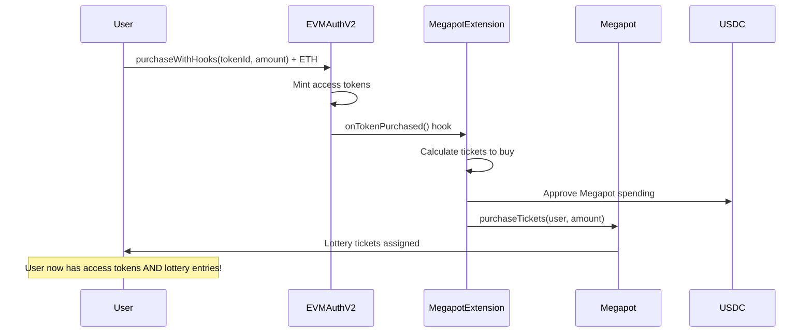

# 🎰 Megapot Extension for EVMAuth V2

The **MegapotExtension** creates a gamified token purchase experience by automatically buying [Megapot](https://docs.megapot.io/developers/developer-reference/contract-overview) lottery tickets whenever users purchase EVMAuth tokens. This integration transforms simple access token purchases into exciting lottery entries!

## 🎯 How It Works



## 🚀 Quick Start

### 1. Deploy the System

```javascript
// Deploy EVMAuth + Megapot extension
const [baseContract, megapotExtension] = await factory.deployEVMAuthWithMegapot(
  "Gaming Access Token",
  "1.0.0",
  "https://api.example.com/metadata/{id}.json",
  0, // no ownership delay
  "0xbEDd4F2beBE9E3E636161E644759f3cbe3d51B95", // Megapot contract on Base
  ethers.ZeroAddress, // no referrer
  { value: deploymentFee }
);
```

### 2. Configure the Extension

```javascript
// Setup automatic lottery ticket purchases
await megapotExtension.updateConfiguration(
  true, // isActive
  2,    // 2 tickets per purchase
  ethers.parseEther("0.005"), // minimum 0.005 ETH for tickets
  true, // useTokenValue - buy tickets proportional to spending
  5     // max 5 tickets per purchase
);
```

### 3. Fund the Extension

```javascript
// Deposit USDC to buy lottery tickets
const usdcAmount = ethers.parseUnits("100", 6); // 100 USDC
await usdcToken.approve(megapotExtensionAddress, usdcAmount);
await megapotExtension.depositMegapotTokens(usdcAmount);
```

### 4. Users Purchase Tokens

```javascript
// User buys access token and automatically gets lottery tickets!
await baseContract.purchaseWithHooks(
  ethers.ZeroAddress, // buy for self
  1, // token ID
  1, // amount
  { value: ethers.parseEther("0.01") } // 0.01 ETH
);

// Check user's lottery stats
const stats = await megapotExtension.getUserStats(userAddress);
console.log(`User got ${stats.ticketsPurchased} lottery tickets!`);
```

## 🎮 Configuration Options

### Ticket Purchase Modes

#### **Fixed Tickets Mode** (`useTokenValue: false`)
- Buy a fixed number of tickets per token purchase
- Simple and predictable for users
- Good for consistent gamification

```javascript
await megapotExtension.updateConfiguration(
  true, // active
  3,    // always buy 3 tickets
  0,    // no minimum purchase
  false, // fixed mode
  10    // max 10 tickets
);
```

#### **Value-Proportional Mode** (`useTokenValue: true`)
- Buy tickets proportional to amount spent
- More tickets for bigger purchases
- Encourages higher-value transactions

```javascript
await megapotExtension.updateConfiguration(
  true, // active
  0,    // ignored in value mode
  ethers.parseEther("0.001"), // min 0.001 ETH for tickets
  true, // value-proportional mode
  20    // max 20 tickets per purchase
);
```

## 📊 Integration with Megapot

### Megapot Contract Details

Based on the [Megapot documentation](https://docs.megapot.io/developers/developer-reference/contract-overview), the integration uses:

- **Contract**: `0xbEDd4F2beBE9E3E636161E644759f3cbe3d51B95` (Base Mainnet)
- **Token**: USDC (6 decimals)
- **Ticket Price**: Dynamic, retrieved from `megapot.ticketPrice()`
- **Purchase Function**: `purchaseTickets(referrer, value, recipient)`

### Automatic Ticket Purchasing

```solidity
// Extension automatically calls this when tokens are purchased
function onTokenPurchased(
    address buyer,
    uint256 tokenId, 
    uint256 amount,
    uint256 totalPrice
) external {
    // Calculate tickets to buy based on configuration
    uint256 ticketsToBuy = _calculateTicketCount(amount, totalPrice);
    
    // Purchase lottery tickets for the user
    _purchaseMegapotTickets(buyer, ticketsToBuy);
}
```

## 💰 Monetization Features

### Referrer Program

Earn fees on every lottery ticket purchase by setting a referrer:

```javascript
// Update referrer to earn fees
await megapotExtension.updateReferrer("0xYourReferrerAddress");
```

### Revenue Streams

1. **EVMAuth Token Sales** - Direct revenue from access tokens
2. **Megapot Referrer Fees** - Percentage of lottery ticket purchases
3. **Enhanced User Engagement** - Gamification increases purchase frequency

## 🔧 Management Functions

### Owner Functions

```javascript
// Update Megapot contract
await megapotExtension.updateMegapotContract(newMegapotAddress);

// Withdraw unused USDC
await megapotExtension.withdrawMegapotTokens(amount);

// Emergency withdraw all funds
await megapotExtension.emergencyWithdrawAll();

// Toggle extension on/off
await megapotExtension.updateConfiguration(false, 0, 0, false, 0); // disable
```

### User Functions

```javascript
// Check lottery stats
const stats = await megapotExtension.getUserStats(userAddress);
console.log({
  ticketsPurchased: stats.ticketsPurchased,
  tokenPurchases: stats.tokenPurchases,
  estimatedTicketsFromBalance: stats.estimatedTicketsFromBalance
});

// Check if extension can buy tickets
const canBuy = await megapotExtension.canPurchaseTickets(5);
console.log(`Can buy 5 tickets: ${canBuy}`);
```

## 📈 Analytics & Monitoring

### Extension Statistics

```javascript
const stats = await megapotExtension.getExtensionStats();
console.log({
  totalTickets: stats.totalTickets,        // Total lottery tickets purchased
  totalTokens: stats.totalTokens,          // Total EVMAuth tokens sold
  contractBalance: stats.contractBalance,   // USDC balance for tickets
  ticketPrice: stats.ticketPrice,          // Current Megapot ticket price
  megapotActive: stats.megapotActive       // Whether Megapot allows purchases
});
```

### Megapot Information

```javascript
const info = await megapotExtension.getMegapotInfo();
console.log({
  megapotContract: info.megapotContract,   // Megapot contract address
  token: info.token,                       // USDC token address
  ticketPrice: info.ticketPrice,           // Current ticket price
  allowPurchasing: info.allowPurchasing,   // Whether purchases are allowed
  currentReferrer: info.currentReferrer    // Current referrer address
});
```

## 🎯 Use Cases

### 1. **Gaming Communities**
- Access tokens for gaming servers/Discord
- Automatic lottery entries for prizes
- Enhanced engagement through gamification

### 2. **Content Creator Subscriptions**
- Monthly access tokens for premium content
- Lottery entries for exclusive merchandise
- Multiple revenue streams

### 3. **Event Access Tokens**
- Conference/event tickets
- Lottery for VIP upgrades
- Increased perceived value

### 4. **Premium Service Access**
- API access tokens
- Lottery for extended service periods
- Gamified subscription model

## ⚠️ Important Considerations

### Gas Optimization
- Extension uses low-level calls to prevent revert on failure
- Automatic ticket purchases won't block token sales if they fail
- Consider gas costs when setting ticket amounts

### USDC Management
- Extension needs USDC balance to purchase lottery tickets
- Monitor balance and refill as needed
- Set appropriate ticket limits to manage costs

### Megapot Integration
- Respects Megapot's `allowPurchasing` status
- Uses current ticket prices dynamically
- Handles referrer fees automatically

### Security
- Owner-only configuration functions
- Emergency withdrawal capabilities
- Fail-safe design - lottery failures don't break token sales

## 🔗 Related Resources

- [Megapot Documentation](https://docs.megapot.io/developers/developer-reference/contract-overview)
- [EVMAuth V2 Architecture](./ARCHITECTURE.md)
- [Base Network Information](https://base.org/)
- [USDC on Base](https://basescan.org/token/0x833589fcd6edb6e08f4c7c32d4f71b54bda02913)

---

## 🎉 Example: Complete Gaming Platform

Here's a complete example of deploying a gaming platform with automatic lottery integration:

```javascript
async function deployGamingPlatform() {
  // 1. Deploy the system
  const [baseContract, megapotExtension] = await factory.deployEVMAuthWithMegapot(
    "Epic Gaming Access",
    "1.0.0",
    "https://api.epicgaming.com/nft/{id}.json",
    0,
    "0xbEDd4F2beBE9E3E636161E644759f3cbe3d51B95", // Megapot
    "0xYourReferrerAddress", // Earn 5% on lottery tickets
    { value: deploymentFee }
  );

  // 2. Setup access tiers
  await baseContract.setMetadata(
    1, // Weekly Pass
    true, true, false,
    ethers.parseEther("0.01"), // 0.01 ETH
    7 * 24 * 60 * 60 // 7 days
  );
  
  await baseContract.setMetadata(
    2, // Monthly Pass  
    true, true, false,
    ethers.parseEther("0.03"), // 0.03 ETH
    30 * 24 * 60 * 60 // 30 days
  );

  // 3. Configure lottery integration
  await megapotExtension.updateConfiguration(
    true, // active
    0,    // calculated dynamically
    ethers.parseEther("0.005"), // min purchase for tickets
    true, // value-proportional tickets
    10    // max 10 tickets per purchase
  );

  // 4. Fund with USDC for lottery tickets
  const usdcAmount = ethers.parseUnits("1000", 6); // 1000 USDC
  await usdcToken.approve(megapotExtension.address, usdcAmount);
  await megapotExtension.depositMegapotTokens(usdcAmount);

  console.log("🎮 Epic Gaming Platform deployed!");
  console.log("✅ Users get access tokens + automatic lottery entries");
  console.log("💰 Multiple revenue streams: tokens + referrer fees");
  console.log("🎯 Gamified experience increases engagement");
}
```

The **MegapotExtension** transforms simple token purchases into an exciting gamified experience, creating additional value for users while generating multiple revenue streams for creators. 🚀🎰
